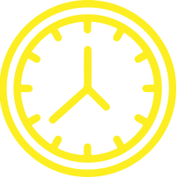

 
 
 

  

 
 

  

 
 
 
  <h1>❓ 1만 시간의 법칙이란?</h1>
  
'1만 시간의 법칙'은 1993년 심리학자 앤더스 에릭슨(K. Anders Ericsson)이 발표한 논문에서 처음 등장한 개념으로, 

  
어떤 분야의 전문가가 되기 위해서는 최소한 1만 시간 정도의 훈련이 필요하다는 법칙이다.

  <h1>✨ Concept</h1>
  
한 분야의 전문가가 되려면 1만시간의 훈련이 필요하다는데,

  
나는 며칠이나 훈련해야할까?

  
'1만 시간의 법칙'은 1만 시간 달성을 위해 필요한 훈련 일 수를 자동으로 계산해 줍니다!

 
 

# ✏ Skills
HTML, CSS, JavaScript

 
 

# 🖥 Responsive
Desktop, Laptop, Tablet, Mobile

 
 

# 👀 Demo
https://minbok-1998.github.io/10000hours/

 
 
 
# ✨프로젝트 소개
개인프로젝트 입니다. 

 
 

# 📆 제작기간
2021년 11월
